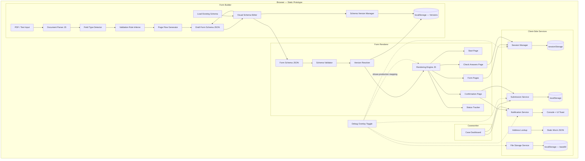
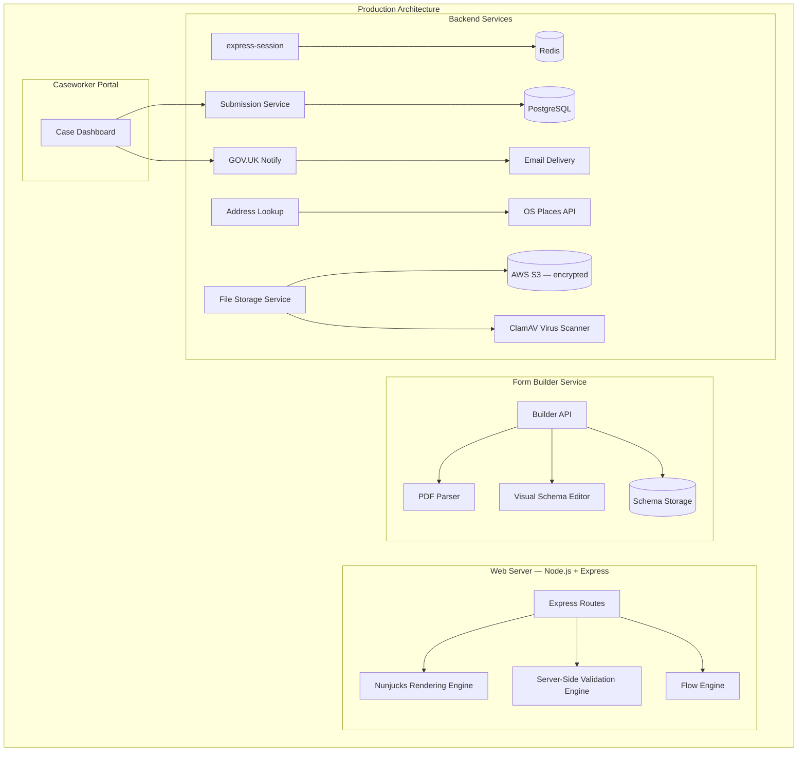
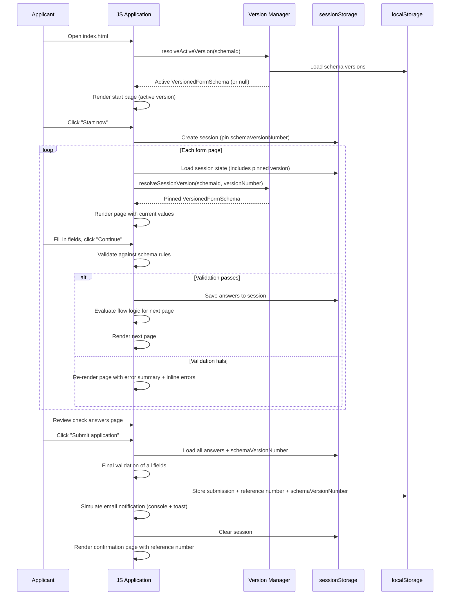
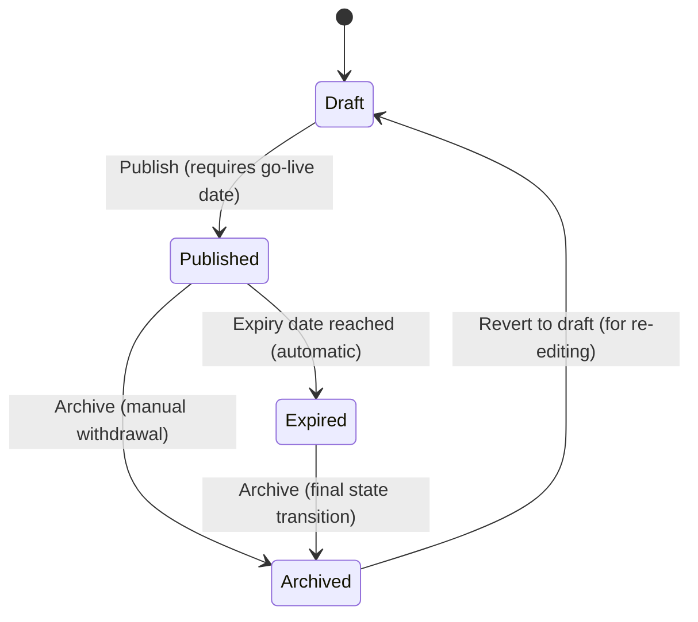

# Design Document

## Overview

This design describes a two-part platform for converting legacy PDF government forms into accessible, GOV.UK-compliant digital services:

1. **Form Builder** — A tool that ingests a PDF or text description of a form and produces a structured Form Schema (JSON). It detects field types, infers validation rules, generates page flows following the "one thing per page" principle, and flags low-confidence inferences for human review. It also provides a **visual schema editor** for loading, editing, and saving existing schemas — so forms can be updated without repeating the full digitisation process. The builder supports **schema versioning** with lifecycle management, allowing Service Owners to maintain multiple versions of a form schema with independent go-live and expiry dates, so that forms can evolve over time while preserving access to previous versions for in-progress applicants and historical submissions.

2. **Form Renderer** — A schema-driven engine that takes a Form Schema and renders a complete multi-page form journey: start page, question pages, check-your-answers page, confirmation page, email notifications, applicant status tracking, and a caseworker dashboard. No custom code is needed per form.

The first form digitised is **FORM-LIC-001** (licence application), which serves as the reference implementation proving the platform works end-to-end.

### Prototype vs Production

This design covers two architectures:

- **Prototype (what we build today)**: A static HTML/CSS/JavaScript application that runs entirely in the browser — no server, no build step, just open `index.html`. Session state uses `sessionStorage`, submissions use `localStorage`, and GOV.UK Frontend CSS is loaded from CDN. A **debug overlay** on each page shows how prototype components map to the production architecture.
- **Production (documented for reference)**: Node.js/Express/Nunjucks, SQLite/PostgreSQL, Redis sessions, GOV.UK Notify for emails, OS Places API for address lookup. The production architecture is documented in a dedicated section below so the prototype demonstrates understanding of the real stack.

### Key Design Decisions

| Decision | Prototype Choice | Production Choice | Rationale |
|---|---|---|---|
| Runtime | Static HTML/CSS/JS — open in browser | Node.js + Express | Prototype needs zero setup; production uses standard GOV.UK stack |
| Templating | Vanilla JS DOM manipulation | Nunjucks | Prototype avoids build tools; production uses GOV.UK Frontend Nunjucks macros |
| UI toolkit | govuk-frontend CSS from CDN | govuk-frontend (npm) | Same visual appearance; prototype loads styles via CDN link |
| Form schema format | JSON (loaded via fetch or embedded) | JSON | Same in both — open, non-proprietary, easy to validate |
| Session storage | sessionStorage (browser) | express-session + Redis | Acceptable for prototype; production needs server-side sessions (Req 17.1) |
| Data persistence | localStorage (submissions) | SQLite / PostgreSQL | Acceptable for prototype demo; production needs durable storage |
| File storage | Base64 data URLs in sessionStorage/localStorage | AWS S3 with server-side encryption + virus scanning (ClamAV) | Prototype demonstrates UX with File API; production needs secure object storage, scanning, and signed URLs |
| Email notifications | Simulated (console log + UI notification) | GOV.UK Notify | Prototype shows what would be sent; production sends real emails |
| Address lookup | Mock data (static JSON) | OS Places API | Prototype demonstrates the UX; production calls real API |
| Testing | Vitest (unit) + fast-check (property-based) | Same | Same test tooling works for client-side JS modules |
| Debug overlay | Toggle on each page showing production mapping | N/A | Demonstrates architectural understanding in the prototype |
| Schema editing | Visual schema editor in Form Builder | Same | Enables ongoing form updates without re-digitisation |
| Schema versioning | localStorage keyed by schema ID + version number | Database with versioned rows, audit trail | Prototype demonstrates version lifecycle; production adds proper indexing and audit |

## Architecture

### Prototype Architecture (What We Build)

The prototype is a static site — a collection of HTML, CSS, and JavaScript files that run entirely in the browser. There is no server, no build step, and no Node.js dependency.



### Production Architecture (Reference Documentation)

The production system would use a server-side architecture following the standard GOV.UK stack:



**Production component mapping** (shown by the debug overlay):

| Prototype Component | Production Equivalent | Notes |
|---|---|---|
| `sessionStorage` | Redis-backed `express-session` | Server-side, encrypted, with configurable TTL |
| `localStorage` (submissions) | PostgreSQL via repository pattern | ACID transactions, proper indexing |
| Base64 data URLs in storage (files) | AWS S3 with server-side encryption | Prototype reads files via File API and stores as base64; production uploads to S3 with virus scanning (ClamAV), stores only metadata in DB, serves via signed URLs |
| Console log notifications | GOV.UK Notify API | Real email delivery with templates |
| Mock address data | OS Places API | Postcode-based address lookup |
| Client-side validation | Server-side validation (+ client-side) | Never rely solely on client-side (Req 9.5) |
| Static HTML pages | Nunjucks templates via Express | Server-rendered with GOV.UK macros |
| In-memory schema loading | Schema stored in database/filesystem | Versioned, with audit trail |
| Schema version store (`localStorage`) | PostgreSQL `schema_versions` table | Versioned rows with lifecycle metadata, proper indexing, audit trail |
| `fetch()` for schema | Express API routes | RESTful endpoints |
| Browser `crypto.getRandomValues()` | Node.js `crypto.randomInt()` | Cryptographically secure in both |

### Debug Overlay

The debug overlay is a toggleable panel that appears on every page of the prototype. When enabled, it provides visual annotations showing how each component maps to the production architecture.

**Activation**: A small "🔧 Debug" button fixed to the bottom-right corner of every page. Clicking it toggles the overlay on/off. State is persisted in `localStorage` so it stays on/off across page navigations.

**Behaviour when enabled**:
- Components on the page gain a subtle dashed border and a tooltip/badge showing the production equivalent
- A slide-out panel on the right lists all production mappings for the current page
- Hovering over a component highlights it and shows detail, e.g.:
  - Session state area → "**Production**: Redis-backed express-session with 30-minute TTL"
  - Error summary → "**Production**: Server-side validation via ValidationEngine, re-rendered by Nunjucks"
  - Submit button → "**Production**: POST to Express route, server validates, stores in PostgreSQL"
  - Email notification → "**Production**: GOV.UK Notify API with template ID and personalisation"
  - Address lookup → "**Production**: OS Places API via AddressLookupService"
  - File upload → "**Production**: AWS S3 with server-side encryption, virus scanning via ClamAV, signed URLs for caseworker access"

**Implementation**: A single `debug-overlay.js` module that:
1. Reads `data-debug-production` attributes from annotated HTML elements
2. Renders tooltip badges and the side panel
3. Toggles visibility via CSS class

### Request Flow (Applicant Journey — Prototype)

In the prototype, all navigation happens client-side. The "pages" are rendered dynamically by JavaScript based on the Form Schema.



### Project Structure

```
licence-application-service/
├── index.html                          # Entry point — open in browser
├── builder.html                        # Form Builder UI (PDF ingestion + schema editor)
├── dashboard.html                      # Caseworker dashboard
├── status.html                         # Status tracker page
├── css/
│   ├── govuk-overrides.css             # Any GOV.UK style overrides
│   └── debug-overlay.css               # Debug overlay styles
├── js/
│   ├── app.js                          # Main application entry, router
│   ├── builder/
│   │   ├── parser.js                   # PDF/text document parser
│   │   ├── fieldDetector.js            # Field type detection
│   │   ├── validationInferrer.js       # Validation rule inference
│   │   ├── flowGenerator.js            # Page flow generation
│   │   ├── schemaGenerator.js          # Orchestrates builder pipeline
│   │   ├── schemaEditor.js             # Visual schema editor UI
│   │   └── schemaVersionManager.js     # Schema version CRUD, lifecycle, and resolution
│   ├── renderer/
│   │   ├── engine.js                   # Core rendering engine (DOM-based)
│   │   ├── schemaValidator.js          # JSON Schema validation
│   │   ├── flowEngine.js               # Conditional page flow logic
│   │   ├── validationEngine.js         # Client-side field validation
│   │   └── pageBuilder.js              # HTML assembly for each page type
│   ├── services/
│   │   ├── submissionService.js        # localStorage-based submission persistence
│   │   ├── notificationService.js      # Simulated email notifications
│   │   ├── addressLookupService.js     # Mock postcode lookup
│   │   ├── fileStorageService.js       # File storage (base64 in localStorage for prototype)
│   │   └── sessionService.js           # sessionStorage-based session management
│   ├── components/
│   │   ├── errorSummary.js             # GOV.UK error summary component
│   │   ├── fieldRenderer.js            # Renders individual field types
│   │   ├── fileUpload.js               # File upload component (input, list, remove, preview)
│   │   └── debugOverlay.js             # Debug overlay toggle + panel
│   └── utils/
│       ├── referenceNumber.js          # Reference number generation
│       ├── dateValidation.js           # Date parsing and age checks
│       └── errorFormatter.js           # GOV.UK error message formatting
├── schemas/
│   ├── formSchema.json                 # JSON Schema for Form Schema validation
│   └── form-lic-001.json              # FORM-LIC-001 schema definition
├── mock-data/
│   └── addresses.json                  # Mock address lookup data
├── test/
│   ├── unit/
│   ├── property/
│   └── integration/
├── package.json                        # Dev dependencies only (vitest, fast-check)
└── README.md
```

## Components and Interfaces

### 1. Form Builder Pipeline

The builder is a sequential pipeline that transforms a source document into a Form Schema. All modules are ES modules that run in the browser.

```typescript
// Document Parser
interface ParsedDocument {
  title: string;
  sections: Section[];
  fields: RawField[];
  instructions: string[];
}

interface RawField {
  label: string;
  rawType: string | null;       // e.g. "checkbox", "text area", "DD/MM/YYYY"
  required: boolean | null;
  groupId: string | null;       // section/group the field belongs to
  hints: string[];              // e.g. ["must be 18 or over"]
  position: number;             // order in source document
}

// Field Type Detector
interface DetectedField extends RawField {
  fieldType: FieldType;         // mapped GOV.UK field type
  confidence: number;           // 0.0–1.0 confidence score
}

// Validation Rule Inferrer
interface InferredValidation {
  fieldLabel: string;
  rules: ValidationRule[];
  confidence: number;
}

// Page Flow Generator
interface GeneratedFlow {
  pages: PageDefinition[];
  flowLogic: FlowRule[];
  startPageMeta: StartPageMeta;
}
```

### 2. Visual Schema Editor

The schema editor provides a GUI for loading, viewing, editing, and saving Form Schemas. It is part of the Form Builder but can also be used standalone to update existing schemas without re-running the PDF ingestion pipeline.

```typescript
interface SchemaEditor {
  /** Load a Form Schema from a JSON file (via file input or drag-and-drop) */
  loadSchema(json: string): FormSchema;

  /** Load a specific version from the version manager into the editor */
  loadVersion(schemaId: string, versionNumber: number): void;

  /** Render the editor UI for the given schema */
  renderEditor(schema: FormSchema): void;

  /** Get the current schema state from the editor */
  getCurrentSchema(): FormSchema;

  /** Validate the current schema and return any errors */
  validateSchema(): SchemaValidationResult;

  /** Export the schema as a JSON string (for download/save) */
  exportSchema(): string;

  /** Save the current editor state as a new version */
  saveAsNewVersion(createdBy: string): VersionedFormSchema;

  /** Open the version history panel */
  showVersionHistory(schemaId: string): void;
}

interface SchemaValidationResult {
  valid: boolean;
  errors: SchemaValidationError[];
}

interface SchemaValidationError {
  path: string;          // JSON path to the invalid property
  message: string;
}
```

**Editor capabilities**:

| Capability | Description |
|---|---|
| Load schema | Open a JSON file via file picker or drag-and-drop; parse and display in the editor |
| Edit fields | Add, remove, reorder fields; change type, label, hint, validation rules |
| Edit validation rules | Add/remove rules per field; edit rule type, value, and error message |
| Edit page groupings | Drag fields between pages; add/remove pages; rename page titles |
| Edit flow logic | Add/remove conditional flow rules; set source page, condition, target/skip pages |
| Edit start page | Edit service name, description, eligibility, "what you need" lists |
| Edit submission config | Edit submit button label, email field reference |
| Edit confirmation | Edit heading, "what happens next" text, contact details |
| Live preview | Side-by-side preview of how the form will render as the schema is edited |
| Validation | Real-time validation against the Form Schema JSON Schema spec; errors highlighted inline |
| Export/save | Download the edited schema as a JSON file |
| Version management | Save as new version, view version history, load any version, clone a version, change lifecycle status, set go-live/expiry dates |

**UI layout**: The editor uses a two-panel layout:
- **Left panel**: Tree/accordion view of the schema structure (pages → fields → rules)
- **Right panel**: Property editor for the selected item, plus a live preview tab

A **version history panel** is accessible from the editor toolbar. It displays all versions of the current schema with their status, go-live date, and expiry date. From this panel the Service Owner can:
- Load any version into the editor
- Create a new version from an existing one (clone)
- Change lifecycle status (Draft → Published, Published → Archived, etc.)
- Set or update go-live and expiry dates

### 2a. Schema Version Manager

The Schema Version Manager handles version CRUD, lifecycle transitions, and version resolution. In the prototype, versions are stored in `localStorage` as a JSON structure keyed by schema ID.

```typescript
interface SchemaVersionManager {
  /** Create a new version of a schema (saves as Draft) */
  createVersion(schemaId: string, schema: FormSchema, createdBy: string): VersionedFormSchema;

  /** Clone an existing version into a new Draft version */
  cloneVersion(schemaId: string, versionNumber: number, createdBy: string): VersionedFormSchema;

  /** Get a specific version */
  getVersion(schemaId: string, versionNumber: number): VersionedFormSchema | null;

  /** List all versions for a schema, ordered by version number descending */
  listVersions(schemaId: string): VersionedFormSchema[];

  /** Resolve the currently active version for new applicants at a given date */
  resolveActiveVersion(schemaId: string, asOfDate?: Date): VersionedFormSchema | null;

  /** Resolve the version for an in-progress session (pinned version) */
  resolveSessionVersion(schemaId: string, versionNumber: number): VersionedFormSchema | null;

  /** Transition a version's lifecycle status */
  transitionStatus(
    schemaId: string,
    versionNumber: number,
    newStatus: SchemaVersionStatus,
    options?: { goLiveDate?: string; expiryDate?: string }
  ): VersionedFormSchema;

  /** Update go-live or expiry dates for a version */
  updateLifecycleDates(
    schemaId: string,
    versionNumber: number,
    dates: { goLiveDate?: string; expiryDate?: string }
  ): VersionedFormSchema;
}
```

**Valid status transitions**:

| From | To | Conditions |
|---|---|---|
| Draft | Published | Must set a go-live date |
| Published | Archived | Immediate — version is withdrawn |
| Published | Expired | Automatic when expiry date is reached; can also be triggered manually |
| Archived | Draft | Allows re-editing a withdrawn version |
| Expired | Archived | Final archival of an expired version |

Invalid transitions (e.g. Draft → Archived, Expired → Published) are rejected with a descriptive error.

### 3. Form Schema (Central Data Contract)

The Form Schema is the contract between the Builder and the Renderer. It is a JSON document validated against a JSON Schema specification.

```typescript
interface FormSchema {
  id: string;                       // e.g. "form-lic-001"
  version: string;                  // semver
  title: string;                    // service name
  startPage: StartPageMeta;
  pages: PageDefinition[];
  flowLogic: FlowRule[];
  submission: SubmissionConfig;
  confirmation: ConfirmationConfig;
}
```

#### Schema Versioning

Each Form Schema can have multiple versions, each with independent lifecycle metadata. When a Service Owner edits a schema, they save it as a new version rather than overwriting the current one. Previous versions are preserved so that in-progress applicants can complete their journey on the version they started, and caseworkers can view submissions against the schema version that was active at the time of submission.

```typescript
/** Lifecycle status for a schema version */
type SchemaVersionStatus = "Draft" | "Published" | "Archived" | "Expired";

/** A versioned Form Schema with lifecycle metadata */
interface VersionedFormSchema {
  schema: FormSchema;               // the full form schema content
  versionNumber: number;            // sequential version number (1, 2, 3, ...)
  status: SchemaVersionStatus;      // lifecycle status
  goLiveDate: string | null;        // ISO 8601 — when this version becomes active for new applicants
  expiryDate: string | null;        // ISO 8601 — when this version stops accepting new submissions
  createdAt: string;                // ISO 8601 — when this version was saved
  createdBy: string;                // who created this version
}
```

**Version lifecycle state machine**:



**Lifecycle rules**:
- **Draft**: The version is being edited. Not visible to applicants. Can be published.
- **Published**: The version is live (or scheduled to go live). Visible to new applicants once the go-live date is reached. A schema can have multiple Published versions with different go-live dates (scheduled releases), but only one is "active" at any given time (the one with the most recent go-live date that is in the past and not expired).
- **Archived**: The version has been manually withdrawn. Not visible to new applicants. Existing in-progress sessions pinned to this version can still complete.
- **Expired**: The version's expiry date has passed. Not visible to new applicants. Existing in-progress sessions pinned to this version can still complete.

**Version resolution logic** (which version to serve):
1. **New applicants**: Get the currently "active" version — the Published version whose go-live date is in the past (or today) and whose expiry date is not in the past (or has no expiry date). If multiple qualify, the one with the most recent go-live date wins.
2. **In-progress applicants**: Continue on the version stored in their session (session is pinned to a schema version at start).
3. **Caseworkers viewing submissions**: See the submission rendered against the schema version that was active when the submission was made (stored on the submission record).
4. **Service Owners in the editor**: Can preview any version regardless of status.

interface StartPageMeta {
  serviceName: string;
  description: string;
  eligibility: string[];
  whatYouNeed: string[];
}

interface PageDefinition {
  id: string;                       // unique page identifier
  title: string;                    // page heading / question
  fields: FieldDefinition[];
  nextPage: string | null;          // default next page id
}

interface FieldDefinition {
  id: string;                       // unique field identifier
  type: FieldType;
  label: string;
  hint?: string;
  validation: ValidationRule[];
  options?: FieldOption[];          // for radio/checkbox/select
  conditional?: ConditionalField;   // show field based on another field's value
  fileConfig?: FileFieldConfig;     // configuration for file upload fields
}

/** Configuration specific to file upload fields (type: "file") */
interface FileFieldConfig {
  maxFileSize: number;              // maximum file size in bytes (e.g. 10485760 for 10MB)
  acceptedFileTypes: string[];      // MIME types or extensions (e.g. ["image/jpeg", "image/png", "application/pdf"])
  maxFiles: number;                 // maximum number of files (default 1; >1 enables multi-file upload)
  hint?: string;                    // e.g. "Upload a JPEG, PNG, or PDF file, up to 10MB"
}

type FieldType = 
  | "text" 
  | "textarea" 
  | "number" 
  | "date" 
  | "radio" 
  | "checkbox" 
  | "select" 
  | "address" 
  | "email"
  | "file";

interface ValidationRule {
  type: "required" | "minLength" | "maxLength" | "pattern" 
      | "min" | "max" | "minAge" | "maxDate" | "minDate" | "email"
      | "maxFileSize" | "acceptedFileTypes";
  value?: string | number | string[];
  message: string;                  // GOV.UK-style error message
}

interface FieldOption {
  value: string;
  label: string;
  hint?: string;
}

interface ConditionalField {
  dependsOn: string;                // field id
  showWhen: string | string[];      // value(s) that trigger display
}

interface FlowRule {
  sourcePageId: string;
  condition: {
    field: string;                  // field id to evaluate
    operator: "equals" | "notEquals" | "in";
    value: string | string[];
  };
  targetPageId: string;             // page to go to when condition is true
  skipPageId: string;               // page to skip to when condition is false
}

interface SubmissionConfig {
  submitButtonLabel: string;
  emailField: string;               // field id for notification destination
}

interface ConfirmationConfig {
  heading: string;
  whatHappensNext: string;
  contactDetails: string;
}
```

### 4. Rendering Engine

The rendering engine reads the Form Schema and generates DOM elements for each page type. In the prototype, this replaces Nunjucks template rendering with direct DOM manipulation. The engine uses the Schema Version Manager to resolve the correct schema version before rendering.

For **file upload fields**, the rendering engine delegates to the `fileUpload` component, which renders:
- A file input (`<input type="file">`) with a visible label and hint text describing accepted types and size limits
- An `accept` attribute on the input matching the field's `acceptedFileTypes`
- After upload: the file name, formatted size, and a "Remove" link
- For multi-file fields (`maxFiles > 1`): a list of uploaded files with individual "Remove" links, and an "Add another file" button (shown until `maxFiles` is reached)
- For image files: a thumbnail preview using the base64 data URL
- Error messages following GOV.UK patterns: "Select a file", "The selected file must be smaller than 10MB", "The selected file must be a JPG, PNG, or PDF"
- Accessible markup: file input has a proper `<label>`, uploaded file list uses `<ul>` with `aria-live="polite"` so additions/removals are announced to screen readers

On the **Check Answers Page**, file upload fields display the uploaded file name(s) with a "Change" link that returns to the upload page. If multiple files are uploaded, they are listed as a comma-separated list of file names.

On the **Caseworker Dashboard**, file fields display file names as download links. In the prototype, these open the base64 data URL in a new tab. In production, they would be time-limited signed URLs to S3.

```typescript
interface RenderingEngine {
  /** Resolve and render the active schema version for a new applicant */
  renderStartPage(schemaId: string): HTMLElement;
  /** Render a form page using the session's pinned schema version */
  renderFormPage(schemaId: string, pageId: string, session: SessionState, errors?: ValidationError[]): HTMLElement;
  renderCheckAnswers(schemaId: string, session: SessionState): HTMLElement;
  renderConfirmation(schemaId: string, referenceNumber: string, schemaVersionNumber: number): HTMLElement;
  /** Render a form page for a specific version (used by caseworkers viewing submissions) */
  renderSubmissionView(schemaId: string, versionNumber: number, submissionData: Record<string, any>): HTMLElement;
}
```

### 5. Validation Engine

Client-side validation that processes schema rules against submitted data. In production, this would also run server-side. For file fields, the validation engine delegates to `FileStorageService.validateFile()` which checks file size, file type, and file count against the field's `FileFieldConfig` and `ValidationRule` entries.

```typescript
interface ValidationEngine {
  validatePage(page: PageDefinition, data: Record<string, string>): ValidationResult;
  validateAllPages(schema: FormSchema, session: SessionState): ValidationResult;
}

interface ValidationResult {
  valid: boolean;
  errors: ValidationError[];
}

interface ValidationError {
  fieldId: string;
  message: string;
  href: string;                     // anchor link for error summary
}
```

### 6. Flow Engine

Evaluates conditional logic to determine page ordering.

```typescript
interface FlowEngine {
  getNextPage(schema: FormSchema, currentPageId: string, session: SessionState): string;
  getPreviousPage(schema: FormSchema, currentPageId: string, session: SessionState): string;
  getApplicablePages(schema: FormSchema, session: SessionState): PageDefinition[];
  isPageApplicable(schema: FormSchema, pageId: string, session: SessionState): boolean;
}
```

### 7. Submission Service

Handles form submission, reference number generation, and persistence to localStorage.

```typescript
interface SubmissionService {
  submit(schemaId: string, schemaVersionNumber: number, data: Record<string, any>, email: string): Submission;
  getByReference(referenceNumber: string): Submission | null;
  listBySchema(schemaId: string, filters?: SubmissionFilters): Submission[];
  updateStatus(referenceNumber: string, status: SubmissionStatus, caseworkerId: string, message?: string): void;
}

interface Submission {
  referenceNumber: string;
  schemaId: string;
  schemaVersionNumber: number;      // the schema version active at time of submission
  data: Record<string, any>;
  files: Record<string, FileMetadata[]>; // file metadata keyed by field id (content in object storage in production)
  email: string;
  status: SubmissionStatus;
  statusHistory: StatusChange[];
  submittedAt: string;              // ISO 8601 date string
}

type SubmissionStatus = "Received" | "In Review" | "Approved" | "Rejected" | "Requires Information";

interface StatusChange {
  status: SubmissionStatus;
  changedAt: string;                // ISO 8601 date string
  changedBy: string;
  message?: string;
}

interface SubmissionFilters {
  status?: SubmissionStatus;
  search?: string;                  // reference number or applicant name
}
```

### 8. Notification Service

Simulates email notifications in the prototype. Logs to console and shows a UI toast notification.

```typescript
interface NotificationService {
  sendAcknowledgement(email: string, referenceNumber: string, serviceName: string, statusTrackerUrl: string): void;
  sendStatusUpdate(email: string, referenceNumber: string, newStatus: SubmissionStatus, message?: string): void;
}
```

In the prototype, each method:
1. Logs the full email content to `console.info()`
2. Displays a toast notification in the UI: "📧 Email sent to {email} — {subject}"
3. Stores the notification in `localStorage` for the debug overlay to display

### 9. Address Lookup Service

Provides postcode-based address lookup using mock data in the prototype.

```typescript
interface AddressLookupService {
  lookup(postcode: string): AddressLookupResult;
}

interface AddressLookupResult {
  success: boolean;
  addresses: Address[];
  error?: string;
}

interface Address {
  addressLine1: string;
  addressLine2?: string;
  townOrCity: string;
  county?: string;
  postcode: string;
}
```

### 10. File Storage Service

Handles file upload, storage, retrieval, and removal. In the prototype, files are read using the browser File API (`FileReader`) and stored as base64 data URLs in `sessionStorage` (in-progress) and `localStorage` (submitted). This is acceptable for small files in a demo but would not scale to production.

```typescript
interface FileStorageService {
  /** Read a file from a File input and store it. Returns metadata including a storage key. */
  storeFile(fieldId: string, file: File): Promise<StoredFile>;

  /** Remove a stored file by its storage key */
  removeFile(fieldId: string, storageKey: string): void;

  /** Get all stored files for a given field */
  getFiles(fieldId: string): StoredFile[];

  /** Get the data URL for a stored file (prototype: base64; production: signed URL) */
  getFileUrl(storageKey: string): string;

  /** Validate a file against the field's FileFieldConfig rules. Returns errors if invalid. */
  validateFile(file: File, config: FileFieldConfig): FileValidationError[];

  /** Move in-progress files from session storage to submission storage */
  persistFilesForSubmission(fieldId: string, submissionRef: string): FileMetadata[];
}

/** A file stored in the prototype (includes base64 content) */
interface StoredFile {
  storageKey: string;               // unique key for retrieval
  name: string;                     // original file name
  size: number;                     // file size in bytes
  type: string;                     // MIME type
  dataUrl: string;                  // base64 data URL (prototype only)
  uploadedAt: string;               // ISO 8601 date string
}

/** File metadata stored on the submission record (no file content) */
interface FileMetadata {
  storageKey: string;               // reference to the stored file
  name: string;                     // original file name
  size: number;                     // file size in bytes
  type: string;                     // MIME type
}

interface FileValidationError {
  type: "fileSize" | "fileType" | "fileCount" | "required";
  message: string;
}
```

**Prototype behaviour**:
- Files are read via `FileReader.readAsDataURL()` and stored as base64 strings
- In-progress files are held in `sessionStorage` (keyed by field ID)
- On submission, file metadata is copied to the submission record in `localStorage`; base64 content is stored alongside for demo purposes
- Image files show a thumbnail preview using the data URL
- File size is limited practically by `sessionStorage`/`localStorage` quotas (~5–10MB per origin)

**Production equivalent** (documented for reference):
- Files uploaded via multipart form POST to an Express route
- Server streams the file through ClamAV virus scanning before accepting
- Clean files stored in AWS S3 with server-side encryption (AES-256)
- Only `FileMetadata` (name, size, type, S3 key) stored in the database
- Caseworker and applicant access via time-limited signed URLs
- File retention policy aligned with data retention requirements
- Maximum file size enforced server-side (e.g. 10MB)

### 11. Session Service

Manages applicant session state using `sessionStorage`.

```typescript
interface SessionService {
  getSession(schemaId: string): SessionState | null;
  saveSession(session: SessionState): void;
  clearSession(schemaId: string): void;
}

interface SessionState {
  schemaId: string;
  schemaVersionNumber: number;      // pinned schema version for this session
  answers: Record<string, any>;     // keyed by field id
  uploadedFiles: Record<string, StoredFile[]>; // keyed by field id — files uploaded during session
  currentPageId: string;
  returnToCheckAnswers: boolean;    // true when editing from check answers
  startedAt: string;                // ISO 8601 date string
}
```

### 12. Debug Overlay Component

```typescript
interface DebugOverlay {
  /** Initialise the overlay, reading toggle state from localStorage */
  init(): void;

  /** Toggle overlay visibility */
  toggle(): void;

  /** Register a production mapping for an element */
  registerMapping(element: HTMLElement, mapping: ProductionMapping): void;

  /** Render the side panel with all mappings for the current page */
  renderPanel(): void;
}

interface ProductionMapping {
  component: string;                // e.g. "Session Storage"
  prototypeImpl: string;            // e.g. "sessionStorage"
  productionImpl: string;           // e.g. "Redis-backed express-session with 30-min TTL"
  notes?: string;                   // additional context
}
```

## Data Models

### Form Schema JSON (stored as file / embedded in page)

The Form Schema is the central artefact. It is stored as a JSON file and validated against a JSON Schema specification at load time. In the prototype, it is either embedded in the HTML or loaded via `fetch()` from the `schemas/` directory.

```json
{
  "$schema": "formSchema.json",
  "id": "form-lic-001",
  "version": "1.0.0",
  "title": "Apply for a licence",
  "startPage": {
    "serviceName": "Apply for a licence",
    "description": "Use this service to apply for a personal, premises, or event licence.",
    "eligibility": ["You must be 18 or over to apply."],
    "whatYouNeed": [
      "the type of licence you need",
      "your previous licence number (if you have one)",
      "your full name and date of birth",
      "your address",
      "your email address"
    ]
  },
  "pages": [
    {
      "id": "licence-type",
      "title": "What type of licence are you applying for?",
      "fields": [
        {
          "id": "licenceType",
          "type": "radio",
          "label": "What type of licence are you applying for?",
          "hint": "Select the type that best describes your application",
          "validation": [
            { "type": "required", "message": "Select a licence type" }
          ],
          "options": [
            { "value": "personal", "label": "Personal", "hint": "A licence for an individual" },
            { "value": "premises", "label": "Premises", "hint": "A licence for a specific location" },
            { "value": "event", "label": "Event", "hint": "A licence for a one-off event" }
          ]
        }
      ]
    },
    {
      "id": "supporting-documents",
      "title": "Upload supporting documents",
      "fields": [
        {
          "id": "identityDocument",
          "type": "file",
          "label": "Upload proof of identity",
          "hint": "Upload a JPEG, PNG, or PDF file, up to 10MB. For example, a scan of your passport or driving licence.",
          "validation": [
            { "type": "required", "message": "Select a file" },
            { "type": "maxFileSize", "value": 10485760, "message": "The selected file must be smaller than 10MB" },
            { "type": "acceptedFileTypes", "value": ["image/jpeg", "image/png", "application/pdf"], "message": "The selected file must be a JPG, PNG, or PDF" }
          ],
          "fileConfig": {
            "maxFileSize": 10485760,
            "acceptedFileTypes": ["image/jpeg", "image/png", "application/pdf"],
            "maxFiles": 1,
            "hint": "Upload a JPEG, PNG, or PDF file, up to 10MB"
          }
        }
      ]
    }
  ],
  "flowLogic": [
    {
      "sourcePageId": "previous-licence-question",
      "condition": {
        "field": "hasPreviousLicence",
        "operator": "equals",
        "value": "yes"
      },
      "targetPageId": "previous-licence-number",
      "skipPageId": "full-name"
    }
  ],
  "submission": {
    "submitButtonLabel": "Submit application",
    "emailField": "emailAddress"
  },
  "confirmation": {
    "heading": "Application submitted",
    "whatHappensNext": "The licensing authority will process your application within 10 working days.",
    "contactDetails": "Contact the licensing authority at licensing@example.gov.uk or call 0300 123 4567."
  }
}
```

### Submission Record (localStorage)

In the prototype, submissions are stored in `localStorage` as a JSON array under the key `submissions`. Each submission record includes the `schemaVersionNumber` that was active when the submission was made, so caseworkers can view the submission against the correct schema version.

```typescript
// Stored as JSON.stringify(submissions) in localStorage
interface StoredSubmissions {
  [schemaId: string]: Submission[];
}
```

**Production equivalent** (documented for reference):

```sql
CREATE TABLE submissions (
    reference_number TEXT PRIMARY KEY,
    schema_id TEXT NOT NULL,
    schema_version_number INTEGER NOT NULL,
    data JSON NOT NULL,
    email TEXT NOT NULL,
    status TEXT NOT NULL DEFAULT 'Received',
    submitted_at DATETIME NOT NULL DEFAULT CURRENT_TIMESTAMP
);

CREATE TABLE submission_files (
    id INTEGER PRIMARY KEY AUTOINCREMENT,
    reference_number TEXT NOT NULL,
    field_id TEXT NOT NULL,
    storage_key TEXT NOT NULL,       -- S3 object key in production; localStorage key in prototype
    file_name TEXT NOT NULL,
    file_size INTEGER NOT NULL,
    file_type TEXT NOT NULL,
    uploaded_at DATETIME NOT NULL DEFAULT CURRENT_TIMESTAMP,
    FOREIGN KEY (reference_number) REFERENCES submissions(reference_number)
);

CREATE TABLE status_history (
    id INTEGER PRIMARY KEY AUTOINCREMENT,
    reference_number TEXT NOT NULL,
    status TEXT NOT NULL,
    changed_by TEXT NOT NULL,
    message TEXT,
    changed_at DATETIME NOT NULL DEFAULT CURRENT_TIMESTAMP,
    FOREIGN KEY (reference_number) REFERENCES submissions(reference_number)
);

CREATE INDEX idx_submissions_schema ON submissions(schema_id);
CREATE INDEX idx_submissions_status ON submissions(status);
CREATE INDEX idx_status_history_ref ON status_history(reference_number);
CREATE INDEX idx_submission_files_ref ON submission_files(reference_number);
```

### Session State (sessionStorage)

```typescript
interface SessionState {
  schemaId: string;
  schemaVersionNumber: number;      // pinned schema version for this session
  answers: Record<string, any>;     // keyed by field id
  uploadedFiles: Record<string, StoredFile[]>; // keyed by field id — files uploaded during session
  currentPageId: string;
  returnToCheckAnswers: boolean;    // true when editing from check answers
  startedAt: string;                // ISO 8601 date string
}
```

Stored in `sessionStorage` under the key `session_{schemaId}`. The `schemaVersionNumber` is set when the applicant starts the form (resolved from the active version at that time) and remains fixed for the duration of the session, even if a newer version becomes active. Cleared on submission or when the browser tab closes (sessionStorage behaviour).

### Schema Versions (localStorage)

In the prototype, schema versions are stored in `localStorage` under the key `schema_versions_{schemaId}` as a JSON array of `VersionedFormSchema` objects.

```typescript
// Stored as JSON.stringify(versions) in localStorage
interface StoredSchemaVersions {
  [schemaId: string]: VersionedFormSchema[];
}
```

Example stored structure:

```json
{
  "form-lic-001": [
    {
      "schema": { "id": "form-lic-001", "version": "1.0.0", "title": "Apply for a licence", "..." : "..." },
      "versionNumber": 1,
      "status": "Archived",
      "goLiveDate": "2024-01-15T00:00:00Z",
      "expiryDate": "2024-06-01T00:00:00Z",
      "createdAt": "2024-01-10T09:30:00Z",
      "createdBy": "service-owner@example.gov.uk"
    },
    {
      "schema": { "id": "form-lic-001", "version": "2.0.0", "title": "Apply for a licence", "..." : "..." },
      "versionNumber": 2,
      "status": "Published",
      "goLiveDate": "2024-06-01T00:00:00Z",
      "expiryDate": null,
      "createdAt": "2024-05-20T14:00:00Z",
      "createdBy": "service-owner@example.gov.uk"
    },
    {
      "schema": { "id": "form-lic-001", "version": "3.0.0", "title": "Apply for a licence", "..." : "..." },
      "versionNumber": 3,
      "status": "Draft",
      "goLiveDate": null,
      "expiryDate": null,
      "createdAt": "2024-11-01T10:00:00Z",
      "createdBy": "service-owner@example.gov.uk"
    }
  ]
}
```

**Production equivalent** (documented for reference):

```sql
CREATE TABLE schema_versions (
    schema_id TEXT NOT NULL,
    version_number INTEGER NOT NULL,
    schema_content JSON NOT NULL,
    status TEXT NOT NULL DEFAULT 'Draft',
    go_live_date DATETIME,
    expiry_date DATETIME,
    created_at DATETIME NOT NULL DEFAULT CURRENT_TIMESTAMP,
    created_by TEXT NOT NULL,
    PRIMARY KEY (schema_id, version_number)
);

CREATE INDEX idx_schema_versions_status ON schema_versions(schema_id, status);
CREATE INDEX idx_schema_versions_go_live ON schema_versions(schema_id, go_live_date);
```

### Reference Number Format

Reference numbers follow the pattern: `LIC-XXXXXX-XXXX` where X is an uppercase alphanumeric character. Generated using `crypto.getRandomValues()` in the browser.

```javascript
function generateReferenceNumber() {
  const chars = 'ABCDEFGHJKLMNPQRSTUVWXYZ23456789'; // excludes I, O, 0, 1 for readability
  const bytes = new Uint8Array(10);
  crypto.getRandomValues(bytes);
  const part1 = Array.from(bytes.slice(0, 6), b => chars[b % chars.length]).join('');
  const part2 = Array.from(bytes.slice(6, 10), b => chars[b % chars.length]).join('');
  return `LIC-${part1}-${part2}`;
}
```

## Correctness Properties

*A property is a characteristic or behavior that should hold true across all valid executions of a system — essentially, a formal statement about what the system should do. Properties serve as the bridge between human-readable specifications and machine-verifiable correctness guarantees.*

### Property 1: Builder output is a valid Form Schema

*For any* valid ParsedDocument (containing any combination of fields, sections, and instructions), the Form Builder SHALL produce output that is valid JSON conforming to the Form Schema JSON Schema specification.

**Validates: Requirements 1.4, 7.1**

### Property 2: Unknown field types default to text with review flag

*For any* RawField whose rawType is not recognisable as a known field type (date, radio, checkbox, address, textarea, email, number), the Field Type Detector SHALL map it to type "text" and assign a confidence score below the review threshold.

**Validates: Requirements 1.5**

### Property 3: Field type detection maps known patterns correctly

*For any* RawField whose label or format indicators match a known field type pattern (date patterns → "date", selection indicators → "radio"/"checkbox", address groups → "address", required markers → required=true, free-text indicators → "textarea"), the Field Type Detector SHALL map it to the corresponding GOV.UK field type.

**Validates: Requirements 2.1, 2.2, 2.3, 2.4, 2.5**

### Property 4: Required fields produce GOV.UK-style error messages using the field label

*For any* field marked as required with a given label, the Validation Rule Inferrer SHALL produce a required validation rule whose error message incorporates the field label (e.g. "Enter your {label}").

**Validates: Requirements 3.2, 3.3**

### Property 5: Age-related hints produce minAge validation rules

*For any* field with hint text containing an age-related instruction (e.g. "must be 18 or over", "you must be at least X years old"), the Validation Rule Inferrer SHALL produce a minAge validation rule with the correct age value.

**Validates: Requirements 3.1**

### Property 6: Inferred rules carry a confidence score in [0, 1]

*For any* InferredValidation produced by the builder, the confidence field SHALL be a number between 0.0 and 1.0 inclusive, and any field with confidence below the review threshold SHALL appear in the flagged-for-review list.

**Validates: Requirements 3.4, 5.2**

### Property 7: Page ordering preserves source document field order

*For any* set of RawFields with position values, the generated PageDefinitions SHALL be ordered such that the minimum field position within each page is monotonically non-decreasing.

**Validates: Requirements 4.2**

### Property 8: Round-trip field completeness — all source fields appear in schema

*For any* ParsedDocument, every RawField in the source SHALL have a corresponding FieldDefinition in the generated Form Schema, and the mapping report SHALL contain an entry for every source field and every schema field.

**Validates: Requirements 6.1, 6.2**

### Property 9: Schema validation rejects schemas with missing required properties

*For any* valid Form Schema with any single required property removed, the Schema Validator SHALL return at least one error whose description references the missing property.

**Validates: Requirements 5.4, 7.4**

### Property 10: Flow logic exclusion — skipped pages are invisible and unrequired

*For any* Form Schema containing FlowRules and *for any* SessionState that triggers a skip condition, the skipped page SHALL NOT appear in getApplicablePages(), its fields SHALL NOT be validated by validateAllPages(), and it SHALL NOT appear on the Check Answers Page.

**Validates: Requirements 8.3, 11.6**

### Property 11: Back navigation never returns a non-applicable page

*For any* Form Schema and *for any* SessionState, getPreviousPage() SHALL never return a page for which isPageApplicable() returns false.

**Validates: Requirements 8.4**

### Property 12: Applicable page order is a subsequence of schema page order

*For any* Form Schema and *for any* SessionState, the list returned by getApplicablePages() SHALL be a subsequence of the schema's pages array (preserving relative order).

**Validates: Requirements 8.5**

### Property 13: Required field validation rejects empty values

*For any* FieldDefinition with a "required" validation rule and *for any* empty string, whitespace-only string, or missing value, validatePage() SHALL return a ValidationError for that field. For file fields, a "required" rule SHALL reject when no files have been uploaded. Conversely, for any non-empty, non-whitespace value (or at least one uploaded file for file fields), the required rule SHALL pass.

**Validates: Requirements 9.2**

### Property 14: Custom error messages are used when defined

*For any* FieldDefinition with a custom error message and *for any* input that violates the field's validation rules, the returned ValidationError SHALL contain the custom error message, not a generic default.

**Validates: Requirements 9.3**

### Property 15: Age-based date validation is correct

*For any* date field with a minAge rule and *for any* valid date of birth, the validation engine SHALL accept the date if and only if the person's age (calculated as of today) is greater than or equal to the minAge value.

**Validates: Requirements 9.4**

### Property 16: Submission data round-trip — store then retrieve preserves data

*For any* valid submission (schema ID, field data, email, and file uploads), storing it via the Submission Service and then retrieving it by reference number SHALL return a record with identical field data, email, schema ID, file metadata (name, size, type for each uploaded file), and a valid reference number and timestamp.

**Validates: Requirements 12.5, 16.1, 16.2**

### Property 17: Reference numbers are unique and well-formed

*For any* N generated reference numbers (N ≥ 100), all SHALL be unique, and each SHALL match the format `LIC-[A-HJ-NP-Z2-9]{6}-[A-HJ-NP-Z2-9]{4}`.

**Validates: Requirements 12.1**

### Property 18: Error display completeness — every validation error appears in summary and inline

*For any* set of ValidationErrors on a page, the rendered output SHALL contain an Error Summary with exactly one linked entry per error, and each field with an error SHALL have an inline error message with a matching aria-describedby attribute.

**Validates: Requirements 13.1, 13.2, 13.4**

### Property 19: Error pages have prefixed titles

*For any* Form Page rendered with at least one validation error, the page title SHALL be prefixed with "Error: ".

**Validates: Requirements 13.3**

### Property 20: Every rendered field has a label with matching for/id

*For any* FieldDefinition rendered by the engine, the output HTML SHALL contain a label element whose `for` attribute matches the input element's `id` attribute.

**Validates: Requirements 14.2**

### Property 21: All rendered pages have unique, descriptive titles

*For any* Form Schema, the set of page titles generated for all pages (start, form pages, check answers, confirmation) SHALL be pairwise unique and each SHALL contain the service name.

**Validates: Requirements 14.7**

### Property 22: Check answers page contains all applicable answered fields

*For any* Form Schema and *for any* SessionState with all applicable fields answered, the Check Answers Page SHALL contain an entry for every applicable field, grouped by page, with labels matching the field labels in the schema. For file upload fields, the entry SHALL display the uploaded file name(s).

**Validates: Requirements 11.1, 11.2**

### Property 23: Stored submissions contain only schema-defined fields

*For any* Form Schema and *for any* submitted data (which may include extra keys), the stored submission record SHALL contain only field IDs that are defined in the schema.

**Validates: Requirements 17.5**

### Property 24: Data minimisation in notifications and status tracker

*For any* Acknowledgement Notification and *for any* Status Tracker response, the output SHALL NOT contain the full submitted form data — only the reference number, status, dates, and service metadata.

**Validates: Requirements 19.3, 20.3**

### Property 25: Dashboard lists all submissions and supports filtering

*For any* set of Submissions for a schema, the Case Dashboard SHALL list all of them with reference number, applicant name, date, and status. *For any* status filter, the filtered results SHALL contain only submissions matching that status. *For any* search query matching a reference number or applicant name, the results SHALL include the matching submission.

**Validates: Requirements 21.1, 21.2, 21.3, 21.4**

### Property 26: Status updates are recorded in history with metadata

*For any* status update (valid status, caseworker ID, optional message), the submission's status history SHALL contain a new entry with the correct status, a timestamp, and the caseworker's identity.

**Validates: Requirements 22.2**

### Property 27: Schema editor round-trip — load then export preserves schema

*For any* valid Form Schema, loading it into the Visual Schema Editor and immediately exporting it (without edits) SHALL produce a schema that is structurally equivalent to the original. Additionally, *for any* valid edit operation (changing a field label, adding a validation rule, reordering pages), the exported schema SHALL be valid according to the Form Schema JSON Schema specification.

**Validates: Requirements 5.3, 5.5**

### Property 28: Version creation round-trip — create then list preserves content and metadata

*For any* valid Form Schema and *for any* valid lifecycle metadata (status, go-live date, expiry date, creator), creating a version via the Schema Version Manager and then listing all versions for that schema SHALL return the created version with identical schema content and all metadata fields intact. The version number SHALL be sequential and unique within the schema.

**Validates: Requirements 5.3, 5.5**

### Property 29: Version resolution returns the correct active version for any date

*For any* set of schema versions with different statuses, go-live dates, and expiry dates, and *for any* reference date, the version resolver SHALL return the Published version whose go-live date is on or before the reference date and whose expiry date is after the reference date (or has no expiry date). If multiple versions qualify, the one with the most recent go-live date SHALL be returned. If no version qualifies, the resolver SHALL return null.

**Validates: Requirements 7.2, 8.1**

### Property 30: Session version pinning — active version changes do not affect in-progress sessions

*For any* session started on schema version N, and *for any* subsequent change to the active version (a newer version becoming Published, the original version being Archived or Expired), resolving the session's schema version SHALL still return version N with its original schema content.

**Validates: Requirements 8.1, 8.3**

### Property 31: Submission-version binding — submissions record and retrieve the correct schema version

*For any* submission made against schema version N, the stored submission record SHALL contain `schemaVersionNumber: N`, and retrieving the submission SHALL allow rendering against version N's schema content.

**Validates: Requirements 12.5, 16.1**

### Property 32: Version clone preserves schema content with new identity

*For any* existing schema version, cloning it SHALL produce a new version with identical schema content, a new sequential version number, and Draft status. The original version SHALL remain unchanged.

**Validates: Requirements 5.3**

### Property 33: Lifecycle state machine — only valid transitions succeed

*For any* schema version with a given lifecycle status and *for any* attempted status transition, the Schema Version Manager SHALL accept the transition if and only if it is in the set of valid transitions (Draft→Published, Published→Archived, Published→Expired, Archived→Draft, Expired→Archived). All other transitions SHALL be rejected with a descriptive error.

**Validates: Requirements 5.3, 5.4**

### Property 34: File validation accepts if and only if all constraints are satisfied

*For any* file and *for any* FileFieldConfig, the file validation SHALL accept the file if and only if: (a) the file size is less than or equal to `maxFileSize`, (b) the file MIME type is in the `acceptedFileTypes` list, and (c) the total number of files for the field does not exceed `maxFiles`. If any constraint is violated, validation SHALL return an error with the corresponding configured error message.

**Validates: Requirements 7.3, 9.1**

### Property 35: File upload rendering includes name, size, and remove action

*For any* StoredFile with a given name and size, the rendered upload feedback SHALL contain the file name, a human-readable formatted file size, and a remove action. For image files (MIME type starting with "image/"), the rendered output SHALL additionally contain a thumbnail preview element.

**Validates: Requirements 7.3**

### Property 36: File removal decreases file count by one and removes the correct file

*For any* non-empty list of StoredFiles for a field and *for any* file in that list identified by storageKey, removing that file SHALL result in the list length decreasing by exactly one, the removed file no longer being present in the list, and all other files remaining unchanged.

**Validates: Requirements 7.3**

### Property 37: File storage round-trip — store then retrieve preserves metadata

*For any* valid file (with a name, size, and MIME type), storing it via the File Storage Service and then retrieving it by storage key SHALL return a StoredFile with identical name, size, and type fields.

**Validates: Requirements 7.3, 12.5**

## Error Handling

### Applicant-Facing Errors

| Error Scenario | Handling | GOV.UK Pattern |
|---|---|---|
| Validation error on form page | Re-render page with Error Summary (linked) at top + inline errors per field. Prefix page title with "Error: ". Focus moved to Error Summary. | [Error summary component](https://design-system.service.gov.uk/components/error-summary/) |
| Empty required field | Display field-specific message, e.g. "Enter your full name" | [Error message component](https://design-system.service.gov.uk/components/error-message/) |
| Invalid date of birth | Specific messages: "Date of birth must be a real date", "Date of birth must be in the past", "You must be 18 or over" | GOV.UK date input error patterns |
| Invalid email format | "Enter an email address in the correct format, like name@example.com" | GOV.UK text input error patterns |
| File not selected (required file field) | "Select a file" | GOV.UK file upload error patterns |
| File exceeds maximum size | "The selected file must be smaller than {maxSize}" (e.g. "10MB") | GOV.UK file upload error patterns |
| File type not accepted | "The selected file must be a {acceptedTypes}" (e.g. "JPG, PNG, or PDF") | GOV.UK file upload error patterns |
| Too many files uploaded | "You can only upload {maxFiles} file(s)" | GOV.UK file upload error patterns |
| File could not be read | "The selected file could not be uploaded — try again" | Graceful degradation |
| Address lookup unavailable | Show manual entry fields with message "Address lookup is currently unavailable. Please enter your address manually." | Graceful degradation |
| Invalid reference number on status tracker | "Reference number not found. Check the number and try again." | Inline error |
| Session expired (tab closed) | sessionStorage is cleared automatically. Applicant starts fresh on next visit. | Start page redirect |

### System Errors (Prototype)

| Error Scenario | Handling |
|---|---|
| Invalid Form Schema loaded | Schema Validator returns descriptive errors identifying the invalid/missing properties. Form does not render with an invalid schema; error displayed in console and on page. |
| localStorage full | Catch the QuotaExceededError. Display a message asking the user to clear browser data. Log to console. |
| File read error (FileReader) | Catch the error event from FileReader. Display "The selected file could not be uploaded — try again". Log to console. |
| sessionStorage quota exceeded (large files) | Catch QuotaExceededError during file storage. Display "The selected file is too large for this prototype. Try a smaller file." Log to console. |
| JSON parse error on schema load | Display a user-friendly error message on the builder page. Log the parse error to console. |
| Mock address lookup returns no results | Display "No addresses found" and show manual entry fields. |
| Unexpected JavaScript error | Global error handler (`window.onerror`) logs the error to console and displays a generic "Something went wrong" message. |

### System Errors (Production — Reference)

| Error Scenario | Production Handling |
|---|---|
| Database write failure on submission | Return HTTP 500 with a generic "Something went wrong" page. Log the error server-side. Do not expose internal details. |
| Email notification failure | Log the failure. Do not block submission — the applicant still sees the confirmation page. Retry notification asynchronously. |
| Address lookup API error | Catch the error and fall back to manual address entry with an explanatory message. |
| File upload virus detected | Reject the file. Return a user-friendly error: "The selected file was rejected. Try uploading a different file." Log the detection for security audit. Do not reveal that a virus was detected. |
| S3 upload failure | Return HTTP 500 with a generic "Something went wrong" page. Log the error. Allow the applicant to retry. |
| S3 signed URL generation failure | Log the error. Display "This file is temporarily unavailable" to the caseworker. |
| Unexpected server error | Express error-handling middleware catches unhandled errors, logs them, and renders a generic error page following GOV.UK patterns. |
| Redis session store unavailable | Fall back to in-memory session store with degraded performance. Alert operations team. |

### Schema Editor Errors

| Error Scenario | Handling |
|---|---|
| Invalid JSON file loaded | Display parse error with line/column number. Do not load the schema. |
| Schema fails validation after edit | Highlight the invalid property in the editor tree. Display the validation error inline. Prevent export until fixed. |
| Unsupported field type in loaded schema | Display a warning badge on the field. Allow editing but flag for review. |
| File too large | Display "File is too large to load in the editor" message. Suggest checking the file. |

### Schema Versioning Errors

| Error Scenario | Handling |
|---|---|
| Invalid lifecycle transition attempted | Display error message describing the invalid transition (e.g. "Cannot archive a Draft version — publish it first"). Do not change the status. |
| Publishing without a go-live date | Display error "Set a go-live date before publishing this version". Prevent the transition. |
| No active version available for new applicant | Display a "Service unavailable" page explaining that the form is not currently accepting new applications. Log a warning. |
| Version not found (session pinned to deleted/corrupted version) | Display an error page asking the applicant to start a new application. Clear the session. Log the error. |
| Duplicate go-live dates across Published versions | Allow it — the resolver picks the version with the highest version number as a tiebreaker. Log a warning for the Service Owner. |
| Expiry date in the past when publishing | Display error "Expiry date must be in the future". Prevent the transition. |
| Go-live date after expiry date | Display error "Go-live date must be before the expiry date". Prevent saving. |

### Error Message Principles

1. **Be specific**: Use the field label in the message ("Enter your full name", not "This field is required")
2. **Be helpful**: Tell the user what to do, not just what went wrong
3. **Be consistent**: Follow GOV.UK error message patterns throughout
4. **Be accessible**: All errors announced to screen readers via Error Summary focus and aria-describedby

## Testing Strategy

### Testing Approach

The testing strategy uses a dual approach, adapted for the static prototype:

1. **Property-based tests** (fast-check) — verify universal properties across randomly generated inputs. Each property test runs a minimum of 100 iterations and references a specific Correctness Property from this design document.
2. **Unit tests** (Vitest) — verify specific examples, edge cases, and concrete scenarios, particularly for FORM-LIC-001 reference implementation details.
3. **Integration tests** (Vitest + jsdom) — verify end-to-end rendering flows, session management, and component wiring in a simulated browser environment.

**Test runner**: [Vitest](https://vitest.dev/) — fast, ESM-native test runner that works with browser-compatible JavaScript modules without a build step.

### Property-Based Testing (fast-check)

**Library**: [fast-check](https://github.com/dubzzz/fast-check) — the leading property-based testing library for JavaScript/TypeScript.

**Configuration**: Each property test runs a minimum of 100 iterations (`numRuns: 100`).

**Tagging**: Each test is tagged with a comment referencing the design property:
```javascript
// Feature: licence-application-service, Property 13: Required field validation rejects empty values
```

**Key property test areas**:

| Property | Component Under Test | Generator Strategy |
|---|---|---|
| P1: Builder output validity | schemaGenerator | Generate random ParsedDocuments with varying field counts, types, and sections |
| P2–P3: Field type detection | fieldDetector | Generate RawFields with known and unknown type indicators |
| P4–P6: Validation inference | validationInferrer | Generate fields with various labels, hints, and required markers |
| P7: Page ordering | flowGenerator | Generate field sets with random positions |
| P8: Field completeness | schemaGenerator | Generate ParsedDocuments and verify all fields appear in output |
| P9: Schema validation | schemaValidator | Generate valid schemas, then systematically remove required properties |
| P10–P12: Flow engine | flowEngine | Generate schemas with FlowRules and random SessionStates |
| P13–P15: Validation engine | validationEngine | Generate FieldDefinitions with rules and random input values |
| P16–P17: Submission round-trip | submissionService | Generate random submission data and reference numbers |
| P18–P21: Rendering correctness | engine + pageBuilder | Generate schemas and verify HTML output properties |
| P22: Check answers completeness | engine | Generate schemas with sessions and verify all fields appear |
| P23: Data minimisation (storage) | submissionService | Generate submissions with extra fields and verify filtering |
| P24: Data minimisation (notifications) | notificationService | Generate submissions and verify notification content |
| P25: Dashboard filtering | submissionService | Generate submission sets and verify filter/search correctness |
| P26: Status history | submissionService | Generate status updates and verify history recording |
| P27: Schema editor round-trip | schemaEditor | Generate valid schemas, load into editor, export, verify equivalence |
| P28: Version creation round-trip | schemaVersionManager | Generate random schemas and metadata, create versions, verify all are preserved |
| P29: Version resolution | schemaVersionManager | Generate sets of versions with random statuses/dates, verify correct active version for any date |
| P30: Session version pinning | schemaVersionManager + sessionService | Generate sessions pinned to a version, change active version, verify session still resolves to original |
| P31: Submission-version binding | submissionService + schemaVersionManager | Generate submissions with version numbers, verify correct version is retrievable |
| P32: Version clone | schemaVersionManager | Generate versions, clone them, verify content equality and new identity |
| P33: Lifecycle state machine | schemaVersionManager | Generate all (status, transition) pairs, verify only valid transitions succeed |
| P34: File validation | fileStorageService + validationEngine | Generate random (file, FileFieldConfig) pairs, verify acceptance iff all constraints satisfied |
| P35: File upload rendering | fileUpload + pageBuilder | Generate random StoredFile objects, render upload feedback, verify name/size/remove present |
| P36: File removal | fileStorageService | Generate random file lists, remove one, verify count and identity |
| P37: File storage round-trip | fileStorageService | Generate random files, store and retrieve, verify metadata preserved |

### Unit Tests (Vitest)

Unit tests cover specific examples and edge cases, particularly for FORM-LIC-001:

- **FORM-LIC-001 schema**: Verify the specific schema renders the correct pages, fields, and flow
- **Date validation edge cases**: Leap years, boundary dates (exactly 18 today), future dates, invalid dates (31 Feb)
- **Email validation**: Specific valid/invalid email formats
- **Address lookup**: Mock responses, empty results, service unavailable fallback
- **Error messages**: Verify exact GOV.UK-compliant error message text for each FORM-LIC-001 field
- **Conditional flow**: Previous licence number yes/no branching
- **Check answers**: Change link navigation and return flow
- **Confirmation page**: Reference number display, "what happens next" content
- **Schema editor**: Load, edit field, edit validation rule, edit page grouping, export
- **File upload component**: Render file input with correct accept attribute, display uploaded file with name/size/remove, multi-file list with "Add another file" button, thumbnail preview for images, remove file from list
- **File validation**: Specific file size boundary (exactly at limit, 1 byte over), specific MIME type matching (case sensitivity, with/without parameters), maxFiles boundary
- **File storage service**: Store and retrieve file, remove file, persist files for submission, handle storage quota exceeded
- **Schema versioning**: Create version, list versions, clone version, lifecycle transitions (valid and invalid), go-live/expiry date validation
- **Version resolution**: Active version for current date, no active version, multiple published versions, expired version exclusion
- **Version history panel**: Display all versions with correct metadata, load version into editor
- **Debug overlay**: Toggle on/off, production mapping display, persistence across pages
- **Session management**: sessionStorage read/write, clear on submission
- **Submission storage**: localStorage read/write, retrieval by reference number

### Integration Tests (Vitest + jsdom)

- **Full applicant journey**: Start → each page → check answers → submit → confirmation (DOM-based)
- **Session management**: Data persists across page renders, clears after submission
- **Error recovery**: Submit with errors → fix → continue
- **Back navigation**: Respects flow logic
- **Status tracker**: Valid and invalid reference number lookups
- **Caseworker dashboard**: List, filter, search, view detail, update status
- **Schema editor workflow**: Load schema → edit fields → validate → export → reload → verify
- **File upload journey**: Render file page → upload file → see feedback → remove → re-upload → continue → check answers shows file name → submit → submission contains file metadata
- **Multi-file upload**: Upload multiple files → verify list → remove one → add another → verify maxFiles enforced
- **File validation errors**: Upload oversized file → see error → upload wrong type → see error → upload valid file → continue
- **Schema versioning workflow**: Create v1 → publish → start applicant session → create v2 → publish v2 → verify applicant still on v1 → submit → verify submission records v1
- **Caseworker version view**: Submit on v1 → publish v2 → caseworker views submission → verify rendered against v1 schema
- **Debug overlay**: Toggle and verify production mappings appear on rendered pages
- **Accessibility**: axe-core automated checks on rendered DOM

### Test Organisation

```
test/
├── unit/
│   ├── builder/
│   │   ├── fieldDetector.test.js
│   │   ├── validationInferrer.test.js
│   │   ├── flowGenerator.test.js
│   │   ├── schemaEditor.test.js
│   │   └── schemaVersionManager.test.js
│   ├── renderer/
│   │   ├── schemaValidator.test.js
│   │   ├── validationEngine.test.js
│   │   ├── flowEngine.test.js
│   │   └── pageBuilder.test.js
│   ├── services/
│   │   ├── submissionService.test.js
│   │   ├── notificationService.test.js
│   │   ├── fileStorageService.test.js
│   │   └── sessionService.test.js
│   ├── components/
│   │   ├── fileUpload.test.js
│   │   └── debugOverlay.test.js
│   └── utils/
│       ├── referenceNumber.test.js
│       └── dateValidation.test.js
├── property/
│   ├── builder.property.test.js
│   ├── flowEngine.property.test.js
│   ├── validationEngine.property.test.js
│   ├── submission.property.test.js
│   ├── rendering.property.test.js
│   ├── dashboard.property.test.js
│   ├── schemaEditor.property.test.js
│   ├── schemaVersionManager.property.test.js
│   └── fileUpload.property.test.js
└── integration/
    ├── applicantJourney.test.js
    ├── fileUploadJourney.test.js
    ├── statusTracker.test.js
    ├── dashboard.test.js
    ├── schemaEditor.test.js
    ├── schemaVersioning.test.js
    └── debugOverlay.test.js
```
